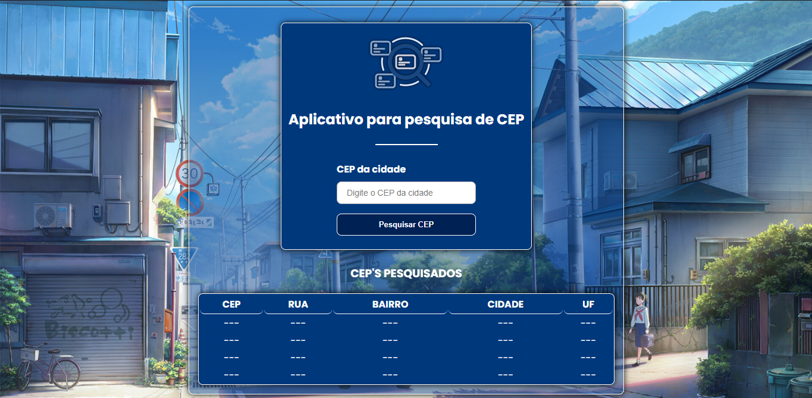

## Sobre o projeto
O projeto consiste em um aplicativo Desktop para fazer busca pelo CEP



## Tecnologias
- [Electron](https://www.electronjs.org/pt/)
- [Electron Reload](https://www.npmjs.com/package/electron-reload)

## Como executar o projeto
```bash
## Clone o projeto
git clone https://github.com/rksex/sistema-buscar-cep-em-electronjs.git

## Entre na pasta do projeto
cd sistema-buscar-cep-em-electronjs

## Instale as dependência
npm install

## Inicie o projeto
npm start
```
